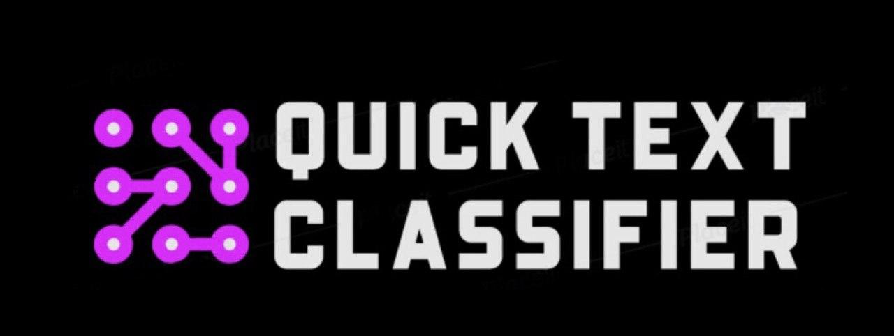

    
	<h4 align="center"> A Fast & Simple Text Detection Framework  <h4>

* * * * *
>**Note: This library is still work in progress**
    All contributions are welcome
    Feel free to request any feature or report bugs by creating an issue for it

* * * * *

QuickText is a text classification framework with two main features:
- Fast training and inference
- Simple and easy training pipeline 

QuickText is built on top of sPacy and PyTorch and the components provided can be extended and modified if required

- [More about QuickText](#more-about-quicktext)

## Available Models

| Model Class | Name | Docs |
|:-----------:|:---------------------------------------------:|:-------------:|
| BiLSTM | Bidirectional LSTM  | [Click here](https://arxiv.org/abs/2003.12137) |

> We are currently adding more models to this framework

## More About QuickText

QuickText uses the following libraries

| Library | Used for |
| ---- | --- |
| [**sPacy**](https://spacy.io/) | Used for text processing and getting feature vectors |
| [**PyTorch**](https://pytorch.org/) | Used for building neural networks for text classification |
| [**Pytorch_lightning**](https://pytorch-lightning.readthedocs.io/en/stable/) | Used for training the models built using PyTorch |

