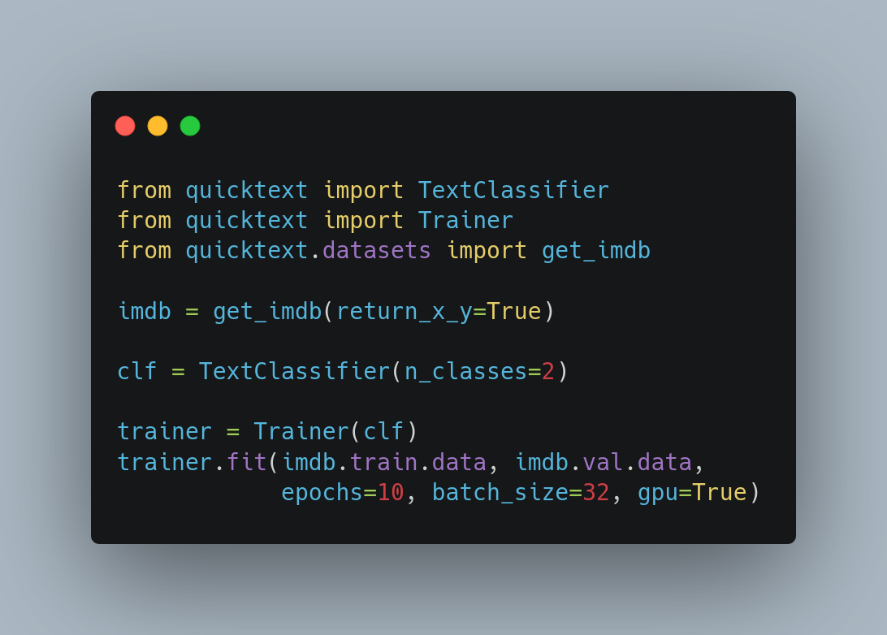

	<h2 align="center"> QuickText </h2>
	<h4 align="center"> Quick and simple text classification framework <h4>

 

* * * * *
>**Note: This project is still work in progress**
    All contributions are welcome
    Feel free to request any feature or report bugs by creating an issue for it

* * * * *

## Available Models

| Model Class | Name | Docs |
|:-----------:|:---------------------------------------------:|:-------------:|
| BiLSTM | Bidirectional LSTM  | [Click here]() |
| CNN2D| 2D Convolutional Net  | [Click here]() |

> We are currently adding more models to this framework

## Contributors

<table>
<tr align="center">

<td>

Ramaneswaran

</td>
</tr>
</table>

	Made with :heart: by <a href="https://dscvit.com">DSC VIT</a>

